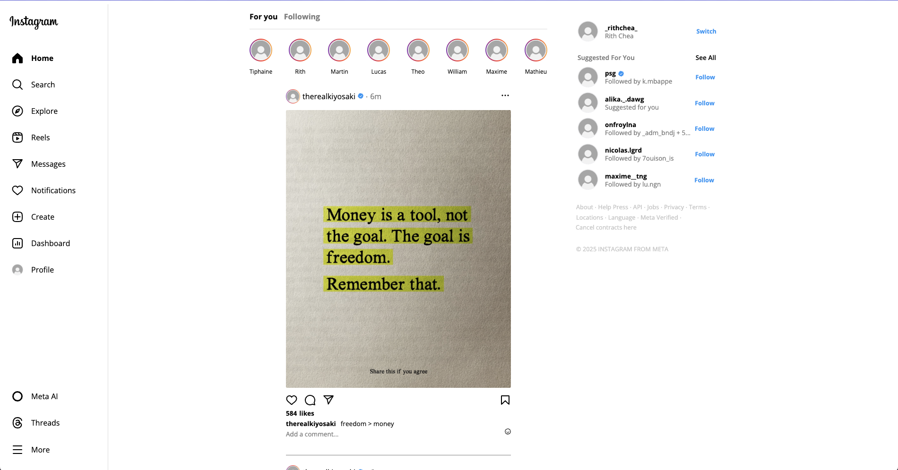

# 📸 InstaLite

A pixel-perfect **clone of Instagram’s homepage** built entirely with **HTML5** and **CSS3** — no frameworks, no JavaScript.  
This project replicates the look and feel of the Instagram web UI as a front-end design exercise.

---

## 🖼 Preview



---

## ✨ Features

- Static clone of Instagram's homepage
- Modern, responsive layout using Flexbox and media queries
- Clean UI with reusable CSS styling
- Fully built with semantic HTML and pure CSS

---

## 🚀 Getting Started

To run this project locally:

```bash
git clone https://github.com/yourusername/instalite.git
cd instalite
open index.html
